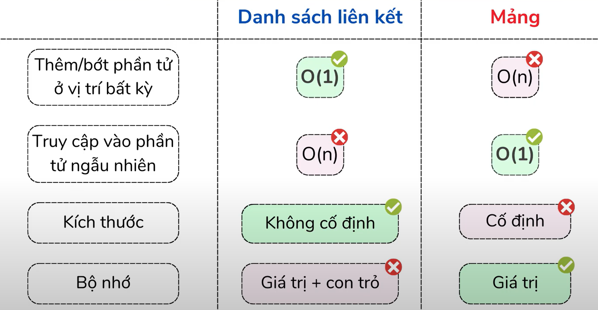
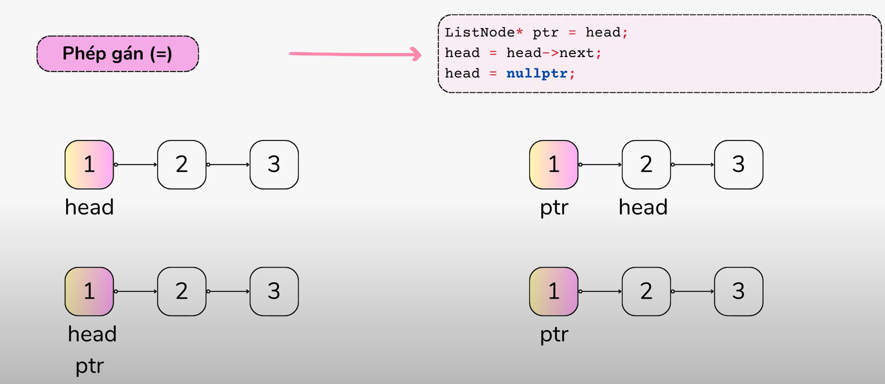
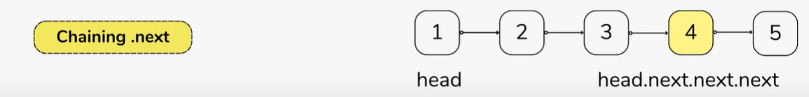
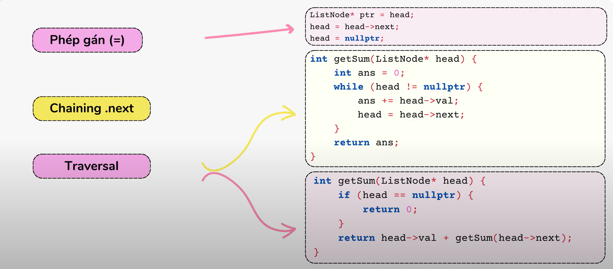
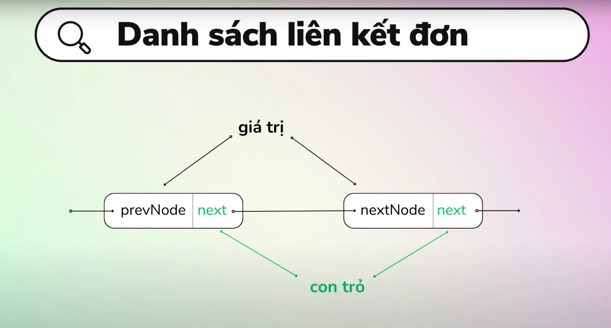

# Danh sách liên kết  
***
Phần 1: Tạo danh sách liên kết  
Danh sách liên kết đơn:  
```cpp
#include <iostream>
using namespace std;

struct LinkedListNode
{
    int value;
    LinkedListNode *next;
    LinkedListNode(int value) : value(value), next(nullptr) {}
};
int main()
{
    LinkedListNode* one = new LinkedListNode(100);
    LinkedListNode* two = new LinkedListNode(200);
    LinkedListNode* three = new LinkedListNode(300);

    one->next = two;
    two->next = three;

    LinkedListNode* head = one;

    cout << head->value << endl; // 100
    cout << head->next->value << endl; // 200
    cout << head->next->next->value << endl; // 300
}
```
So sánh mảng và danh sách liên kết:  
  
Cơ chế hoạt động:  
1. Phép gán(=)
  
2. Chaining .next:
  
3. Traversal:
  

Phần 2: Các loại sách liên kết  
Danh sách liên kết đơn:

- Hàm Thêm một nút ở danh sách liên kết đơn
```ccp
struct ListNode
{
    int value;
    ListNode* next;
    ListNode(int val) : value(val), next(nullptr) {}
};

void addNode(ListNode* prevNode, ListNode* nodeToAdd)
{
    nodeToAdd->next = prevNode->next;
    prevNode->next = nodeToAdd;
}
```
   


